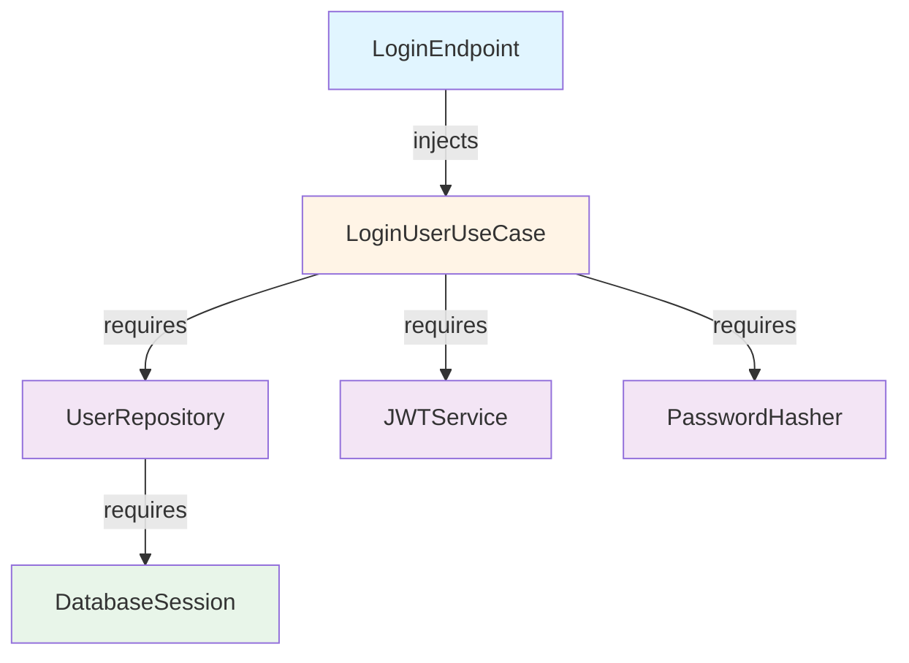

## Overview

Soft-Bee API uses the **dependency-injector** library to manage dependencies, enabling loose coupling, testability, and maintainable code.

<Note>
  Dependency Injection (DI) is a design pattern where objects receive their dependencies from external sources rather than creating them internally.
</Note>

## Why Dependency Injection?

<CardGroup cols={2}>
  <Card title="Loose Coupling" icon="link-slash">
    Components depend on interfaces, not concrete implementations
  </Card>
  <Card title="Testability" icon="flask-vial">
    Easy to replace real implementations with mocks for testing
  </Card>
  <Card title="Flexibility" icon="arrows-rotate">
    Swap implementations without changing code (e.g., PostgreSQL → MongoDB)
  </Card>
  <Card title="Single Responsibility" icon="bullseye">
    Objects focus on their logic, not creating dependencies
  </Card>
</CardGroup>

## Container Structure

Dependencies are organized in **containers** defined in `src/core/dependencies/containers.py`:

```python src/core/dependencies/containers.py
from dependency_injector import containers, providers

class AuthContainer(containers.DeclarativeContainer):
    """Container for auth feature dependencies"""
    
    # Configuration
    config = providers.Configuration()
    
    # External dependencies
    db_session = providers.Dependency()
    
    # Repositories
    user_repository = providers.Factory(
        UserRepositoryImpl,
        db_session=db_session
    )
    
    # Services
    password_hasher = providers.Singleton(
        PasswordHasher,
        algorithm=config.auth.password_algorithm
    )
    
    jwt_service = providers.Singleton(
        JWTService,
        secret_key=config.auth.jwt_secret_key,
        algorithm=config.auth.jwt_algorithm,
        issuer=config.auth.jwt_issuer,
        audience=config.auth.jwt_audience
    )
    
    # Use Cases
    login_use_case = providers.Factory(
        LoginUserUseCase,
        user_repository=user_repository,
        token_service=jwt_service,
        password_hasher=password_hasher
    )
    
    register_use_case = providers.Factory(
        RegisterUserUseCase,
        user_repository=user_repository,
        password_hasher=password_hasher
    )

class MainContainer(containers.DeclarativeContainer):
    """Main application container"""
    
    config = providers.Configuration()
    db_session = providers.Dependency()
    
    # Feature containers
    auth = providers.Container(
        AuthContainer,
        db_session=db_session,
        config=config.auth
    )
```

## Provider Types

The library offers different provider types for different needs:

<AccordionGroup>
  <Accordion title="Factory Provider">
    **Creates a new instance** every time it's called. Use for objects with state that shouldn't be shared.
    
    ```python
    user_repository = providers.Factory(
        UserRepositoryImpl,
        db_session=db_session
    )
    ```
    
    **When to use:** Repositories, use cases, or any stateful object that should be created fresh for each request.
  </Accordion>
  
  <Accordion title="Singleton Provider">
    **Creates one instance** and reuses it. Use for stateless services.
    
    ```python
    jwt_service = providers.Singleton(
        JWTService,
        secret_key=config.auth.jwt_secret_key
    )
    ```
    
    **When to use:** Password hashers, JWT services, email services, or any stateless utility.
  </Accordion>
  
  <Accordion title="Configuration Provider">
    **Provides configuration values** from various sources.
    
    ```python
    config = providers.Configuration()
    # Access: config.auth.jwt_secret_key
    ```
    
    **When to use:** Application settings, environment variables, feature flags.
  </Accordion>
  
  <Accordion title="Dependency Provider">
    **Placeholder for external dependencies** that will be provided by parent containers.
    
    ```python
    db_session = providers.Dependency()
    ```
    
    **When to use:** Database sessions, app context, or anything provided by the framework.
  </Accordion>
</AccordionGroup>

## Injection in Endpoints

Use the `@inject` decorator to inject dependencies into Flask routes:

```python src/features/auth/presentation/api/v1/endpoints/auth.py
from flask import Blueprint, request, jsonify
from dependency_injector.wiring import inject, Provide
from .....application.use_cases.login_user import LoginUserUseCase
from src.core.dependencies.containers import MainContainer as Container

auth_bp = Blueprint('auth_v1', __name__, url_prefix='/api/v1/auth')

@auth_bp.route('/login', methods=['POST'])
@inject
def login(
    login_use_case: LoginUserUseCase = Provide[Container.auth.login_use_case]
):
    """Login endpoint with dependency injection"""
    data = request.get_json()
    
    # Convert to DTO
    login_request = LoginRequestDTO(**data)
    
    # Execute use case (injected automatically)
    result, error = login_use_case.execute(login_request)
    
    if error:
        return jsonify({"error": error}), 401
    
    return jsonify(result), 200
```

<Tip>
  The `@inject` decorator automatically resolves dependencies using the `Provide[...]` syntax. You don't need to manually create or pass dependencies!
</Tip>

### How It Works

<Steps>
  <Step title="Decorator applies">
    The `@inject` decorator intercepts function calls
  </Step>
  
  <Step title="Dependencies resolved">
    When the route is called, `Provide[Container.auth.login_use_case]` tells the container to create/fetch the LoginUserUseCase
  </Step>
  
  <Step title="Nested dependencies resolved">
    The container also resolves the use case's dependencies (repository, token service, password hasher)
  </Step>
  
  <Step title="Function executes">
    The route function receives the fully-constructed use case and executes normally
  </Step>
</Steps>

## Container Initialization

Initialize containers when the Flask app starts:

```python app.py
from flask import Flask
from src.core.dependencies.containers import MainContainer
from src.core.database.db import get_db

def create_app():
    app = Flask(__name__)
    
    # Create container
    container = MainContainer()
    
    # Configure container
    container.config.from_dict({
        'auth': {
            'jwt_secret_key': app.config['JWT_SECRET_KEY'],
            'jwt_algorithm': app.config['JWT_ALGORITHM'],
            'jwt_issuer': 'soft-bee-api',
            'jwt_audience': 'soft-bee-users',
            'password_algorithm': 'bcrypt'
        }
    })
    
    # Provide database session
    container.db_session.override(get_db)
    
    # Wire container with modules
    container.wire(modules=[
        'src.features.auth.presentation.api.v1.endpoints.auth'
    ])
    
    app.container = container
    
    return app
```

<Note>
  Wiring tells the container which modules contain `@inject` decorators so it can resolve dependencies in those modules.
</Note>

## Testing with Dependency Injection

DI makes testing incredibly easy by allowing you to override dependencies with mocks:

```python tests/test_login.py
import pytest
from unittest.mock import Mock
from src.core.dependencies.containers import MainContainer
from src.features.auth.application.use_cases.login_user import LoginUserUseCase

@pytest.fixture
def container():
    """Create test container with mocked dependencies"""
    container = MainContainer()
    
    # Mock repository
    mock_repository = Mock()
    mock_repository.find_by_email.return_value = mock_user
    container.auth.user_repository.override(mock_repository)
    
    # Mock token service
    mock_token_service = Mock()
    mock_token_service.create_access_token.return_value = 'mock_token'
    container.auth.jwt_service.override(mock_token_service)
    
    return container

def test_login_success(container):
    """Test successful login"""
    # Get use case with mocked dependencies
    use_case = container.auth.login_use_case()
    
    # Execute
    result, error = use_case.execute(LoginRequestDTO(
        email='test@example.com',
        password='password123'
    ))
    
    # Assert
    assert error is None
    assert result.access_token == 'mock_token'
```

<Tip>
  Use `.override()` to replace real implementations with mocks. This lets you test use cases without a database or external services!
</Tip>

## Dependency Graph Example

Here's how dependencies flow for a login request:



1. **Endpoint** requests `LoginUserUseCase`
2. **Container** creates the use case with its dependencies:
   - `UserRepository` (with database session)
   - `JWTService` (singleton)
   - `PasswordHasher` (singleton)
3. All dependencies are automatically resolved and injected

## Best Practices

<CardGroup cols={2}>
  <Card title="Use Interfaces" icon="handshake">
    Depend on interfaces (abstract classes) not concrete implementations
  </Card>
  <Card title="Keep Containers Organized" icon="folder-tree">
    One container per feature for better organization
  </Card>
  <Card title="Singleton for Stateless" icon="circle-1">
    Use Singleton for services without state (JWT, password hasher)
  </Card>
  <Card title="Factory for Stateful" icon="industry">
    Use Factory for objects with state (repositories, use cases)
  </Card>
</CardGroup>

### Don't

<Warning>
  - Don't create dependencies manually inside classes (e.g., `self.repo = UserRepository()`)
  - Don't use global singletons outside the container
  - Don't mix business logic with dependency creation
  - Don't forget to wire modules that use `@inject`
</Warning>

### Do

<Check>
  - Inject all dependencies through constructors
  - Define dependencies in containers
  - Use `@inject` for route handlers
  - Override dependencies in tests
  - Keep containers close to features they serve
</Check>

## Advanced: Multiple Feature Containers

As your application grows, organize containers by feature:

```python
class HivesContainer(containers.DeclarativeContainer):
    """Container for hives feature"""
    config = providers.Configuration()
    db_session = providers.Dependency()
    
    hive_repository = providers.Factory(
        HiveRepositoryImpl,
        db_session=db_session
    )
    
    create_hive_use_case = providers.Factory(
        CreateHiveUseCase,
        hive_repository=hive_repository
    )

class MainContainer(containers.DeclarativeContainer):
    """Main container with all features"""
    config = providers.Configuration()
    db_session = providers.Dependency()
    
    # Feature containers
    auth = providers.Container(AuthContainer, db_session=db_session)
    hives = providers.Container(HivesContainer, db_session=db_session)
    apiaries = providers.Container(ApiariesContainer, db_session=db_session)
```

<Tip>
  This keeps each feature's dependencies isolated and maintainable.
</Tip>

## Related Pages

<CardGroup cols={2}>
  <Card title="Clean Architecture" icon="layer-group" href="/architecture/clean-architecture">
    See how DI fits into the architecture layers
  </Card>
  <Card title="Project Structure" icon="folder-tree" href="/architecture/project-structure">
    Understand where containers live in the project
  </Card>
  <Card title="Testing Guide" icon="flask-vial" href="/development/testing">
    Learn how to test with mocked dependencies
  </Card>
</CardGroup>
