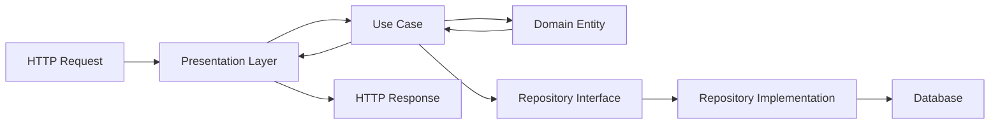

## Introduction

Soft-Bee API is built using **Clean Architecture** and **Domain-Driven Design (DDD)** principles, creating a maintainable, testable, and scalable Flask REST API for beekeeping management.

<Note>
  Clean Architecture ensures that business logic remains independent of frameworks, databases, and external services.
</Note>

## Core Principles

The architecture follows these fundamental principles:

<CardGroup cols={2}>
  <Card title="Separation of Concerns" icon="layer-group">
    Each layer has a specific responsibility and doesn't know about layers above it
  </Card>
  <Card title="Dependency Inversion" icon="arrows-rotate">
    Dependencies point inward - business logic never depends on infrastructure
  </Card>
  <Card title="Feature-Based Structure" icon="folder-tree">
    Code is organized by business features, not technical layers
  </Card>
  <Card title="Testability" icon="flask-vial">
    Business logic can be tested without databases or external services
  </Card>
</CardGroup>

## Architecture Layers

The application is organized into three main layers:

<Steps>
  <Step title="Domain Layer">
    Contains business entities, value objects, domain events, and business rules. This is the heart of the application.
    
    **Location:** `src/features/{feature}/domain/`
  </Step>
  
  <Step title="Application Layer">
    Orchestrates business logic through use cases. Contains DTOs, interfaces, and application services.
    
    **Location:** `src/features/{feature}/application/`
  </Step>
  
  <Step title="Infrastructure Layer">
    Implements technical concerns like database access, external services, and API endpoints.
    
    **Location:** `src/features/{feature}/infrastructure/` and `src/features/{feature}/presentation/`
  </Step>
</Steps>

## Feature-Based Organization

Each feature is self-contained with its own domain, application, and infrastructure code:

```
src/features/
└── auth/
    ├── domain/           # Business entities and rules
    ├── application/      # Use cases and DTOs
    ├── infrastructure/   # Database and external services
    └── presentation/     # API endpoints and schemas
```

<Tip>
  This structure makes it easy to understand, maintain, and scale individual features independently.
</Tip>

## Key Benefits

<AccordionGroup>
  <Accordion title="Independence from Frameworks">
    Business logic doesn't depend on Flask or any other framework. You could switch to FastAPI or Django without changing core business rules.
  </Accordion>
  
  <Accordion title="Testable Business Logic">
    Domain entities and use cases can be tested without starting a database or web server.
  </Accordion>
  
  <Accordion title="Flexible Infrastructure">
    Database implementations can be swapped (e.g., PostgreSQL → MongoDB) without changing business logic.
  </Accordion>
  
  <Accordion title="Clear Boundaries">
    Each layer has well-defined responsibilities, making the codebase easier to understand and maintain.
  </Accordion>
</AccordionGroup>

## Application Flow

Here's how a typical request flows through the application:



1. **Presentation Layer** receives HTTP request and validates input
2. **Use Case** orchestrates business logic
3. **Domain Entities** enforce business rules
4. **Repository** handles data persistence
5. Response flows back through the layers

## Next Steps

<CardGroup cols={2}>
  <Card title="Clean Architecture Details" icon="circle-nodes" href="/architecture/clean-architecture">
    Deep dive into the three layers and their responsibilities
  </Card>
  <Card title="Project Structure" icon="folder-tree" href="/architecture/project-structure">
    Detailed breakdown of the directory structure
  </Card>
  <Card title="Dependency Injection" icon="plug" href="/architecture/dependency-injection">
    Learn how dependencies are managed and injected
  </Card>
  <Card title="Getting Started" icon="rocket" href="/quickstart">
    Start building with Soft-Bee API
  </Card>
</CardGroup>
