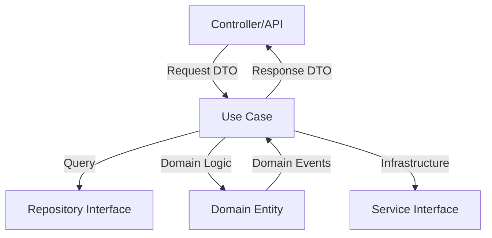

# Use Cases

Use cases are the heart of the application layer in Clean Architecture. They orchestrate the flow of data to and from entities, and direct those entities to use their business rules to achieve the goals of the use case.

## Purpose

Use cases in Soft-Bee API:
- Encapsulate and implement all business logic for a specific feature
- Coordinate between domain entities, repositories, and services
- Remain independent of frameworks, UI, and databases
- Define clear input/output boundaries using DTOs
- Handle cross-cutting concerns like event publishing

## Use Case Pattern

Each use case follows a consistent pattern:

1. **Dependency injection** - Receive interfaces (not implementations) via constructor
2. **Single execute method** - One public method that takes a request DTO and returns a response
3. **Business orchestration** - Coordinate domain entities and infrastructure services
4. **Error handling** - Return typed errors or exceptions
5. **Event publishing** - Publish domain events when necessary

## Example: Register User Use Case

The `RegisterUserUseCase` demonstrates the use case pattern for user registration:

```python
from typing import Tuple, Optional, Dict, Any
from datetime import datetime
from ...domain.entities.user import User
from ...domain.value_objects.email import Email
from ...application.dto.auth_dto import RegisterRequestDTO, RegisterResponseDTO
from ...application.interfaces.repositories.user_repository import IUserRepository
from ...domain.exceptions.auth_exceptions import EmailAlreadyExistsException

class RegisterUserUseCase:
    """Caso de uso: Registrar usuario"""
    
    def __init__(
        self,
        user_repository: IUserRepository,
        password_hasher: Any,
        event_publisher: Optional[Any] = None
    ):
        self.user_repository = user_repository
        self.password_hasher = password_hasher
        self.event_publisher = event_publisher
    
    def execute(self, request: RegisterRequestDTO) -> Tuple[Optional[RegisterResponseDTO], Optional[str]]:
        """
        Ejecutar registro de usuario
        
        Returns:
            Tuple[Optional[RegisterResponseDTO], Optional[str]]: (response, error_message)
        """
        try:
            # 1. Verificar si email ya existe
            if self.user_repository.exists_by_email(request.email):
                raise EmailAlreadyExistsException()
            
            # 2. Verificar si username ya existe
            if self.user_repository.exists_by_username(request.username):
                return None, "Username already exists"
            
            # 3. Hash password
            hashed_password = self.password_hasher.hash(request.password)
            
            # 4. Crear entidad de dominio
            user = User(
                email=Email(request.email),
                username=request.username,
                hashed_password=hashed_password
            )
            
            # 5. Guardar usuario
            saved_user = self.user_repository.save(user)
            
            # 6. Publicar evento si hay publisher
            if self.event_publisher:
                events = saved_user.pull_events()
                for event in events:
                    self.event_publisher.publish(event)
            
            # 7. Crear respuesta
            response = RegisterResponseDTO(
                id=saved_user.id,
                email=str(saved_user.email),
                username=saved_user.username,
                is_verified=saved_user.is_verified,
                created_at=saved_user.created_at
            )
            
            return response, None
            
        except Exception as e:
            return None, str(e)
```

**Location:** `src/features/auth/application/use_cases/register_user.py:9`

### Key Features

1. **Dependency Inversion** - Depends on `IUserRepository` interface, not concrete implementation
2. **Domain Entity Creation** - Creates `User` entity with `Email` value object
3. **Event Publishing** - Pulls and publishes domain events from the entity
4. **DTO Boundaries** - Clear input (`RegisterRequestDTO`) and output (`RegisterResponseDTO`)
5. **Business Validation** - Checks for duplicate email and username

## Example: Login User Use Case

The `LoginUserUseCase` demonstrates authentication logic:

```python
from typing import Tuple, Optional, Dict, Any
from datetime import datetime, timedelta
from ...application.dto.auth_dto import LoginRequestDTO, LoginResponseDTO
from ...application.interfaces.repositories.user_repository import IUserRepository
from ...application.interfaces.services.token_service import ITokenService

class LoginUserUseCase:
    """Caso de uso: Login de usuario"""
    
    def __init__(
        self,
        user_repository: IUserRepository,
        token_service: ITokenService,
        password_hasher: Any
    ):
        self.user_repository = user_repository
        self.token_service = token_service
        self.password_hasher = password_hasher
    
    def execute(self, request: LoginRequestDTO) -> Tuple[Optional[LoginResponseDTO], Optional[str]]:
        """Ejecutar login de usuario"""
        try:
            # 1. Buscar usuario por email
            user = self.user_repository.find_by_email(request.email)
            if not user:
                raise UserNotFoundException()
            
            # 2. Verificar si la cuenta está bloqueada
            if user.is_locked():
                raise AccountLockedException()
            
            # 3. Verificar password
            if not self.password_hasher.verify(request.password, user.hashed_password):
                user.login_failed()
                self.user_repository.save(user)
                raise InvalidCredentialsException()
            
            # 4. Login exitoso
            user.login_successful()
            self.user_repository.save(user)
            
            # 5. Generar tokens
            token_data = {
                "sub": user.id,
                "email": str(user.email),
                "username": user.username,
                "is_verified": user.is_verified
            }
            
            access_token = self.token_service.create_access_token(
                token_data,
                expires_in=86400 if request.remember_me else 900
            )
            
            refresh_token = self.token_service.create_refresh_token(
                {"sub": user.id},
                expires_in=2592000 if request.remember_me else 604800
            )
            
            # 6. Guardar refresh token
            self.user_repository.add_refresh_token(user.id, refresh_token)
            
            # 7. Crear respuesta
            response = LoginResponseDTO(
                access_token=access_token,
                refresh_token=refresh_token,
                token_type="bearer",
                expires_in=86400 if request.remember_me else 900,
                user={
                    "id": user.id,
                    "email": str(user.email),
                    "username": user.username,
                    "is_verified": user.is_verified,
                    "is_active": user.is_active
                }
            )
            
            return response, None
            
        except Exception as e:
            # Handle specific exceptions
            return None, str(e)
```

**Location:** `src/features/auth/application/use_cases/login_user.py:12`

### Key Features

1. **Domain Logic Delegation** - Calls `user.login_failed()` and `user.login_successful()` on the entity
2. **Multiple Dependencies** - Uses both `IUserRepository` and `ITokenService` interfaces
3. **Conditional Logic** - Adjusts token expiry based on `remember_me` flag
4. **Security** - Handles account locking and failed login attempts
5. **State Management** - Updates user state and persists refresh tokens

## Use Case Workflow

Typical use case execution flow:



## Best Practices

1. **Single Responsibility** - Each use case handles one business operation
2. **Depend on Abstractions** - Inject interfaces, not concrete classes
3. **Use DTOs** - Never expose domain entities directly in responses
4. **Domain-Driven** - Let domain entities handle business rules
5. **Fail Gracefully** - Return meaningful error messages
6. **Framework Independent** - No Flask, SQLAlchemy, or other framework code
7. **Testable** - Easy to unit test with mocked dependencies

## Testing Use Cases

Use cases are highly testable due to dependency injection:

```python
def test_register_user_success():
    # Arrange
    mock_repository = Mock(spec=IUserRepository)
    mock_repository.exists_by_email.return_value = False
    mock_repository.exists_by_username.return_value = False
    
    use_case = RegisterUserUseCase(
        user_repository=mock_repository,
        password_hasher=Mock(),
        event_publisher=None
    )
    
    request = RegisterRequestDTO(
        email="test@example.com",
        username="testuser",
        password="password123",
        confirm_password="password123"
    )
    
    # Act
    response, error = use_case.execute(request)
    
    # Assert
    assert error is None
    assert response is not None
    assert response.email == "test@example.com"
```

## See Also

- [DTOs](/development/application/dtos) - Data Transfer Objects for use case boundaries
- [Interfaces](/development/application/interfaces) - Repository and service interfaces
- [Domain Entities](/development/domain/entities) - Business logic and rules
